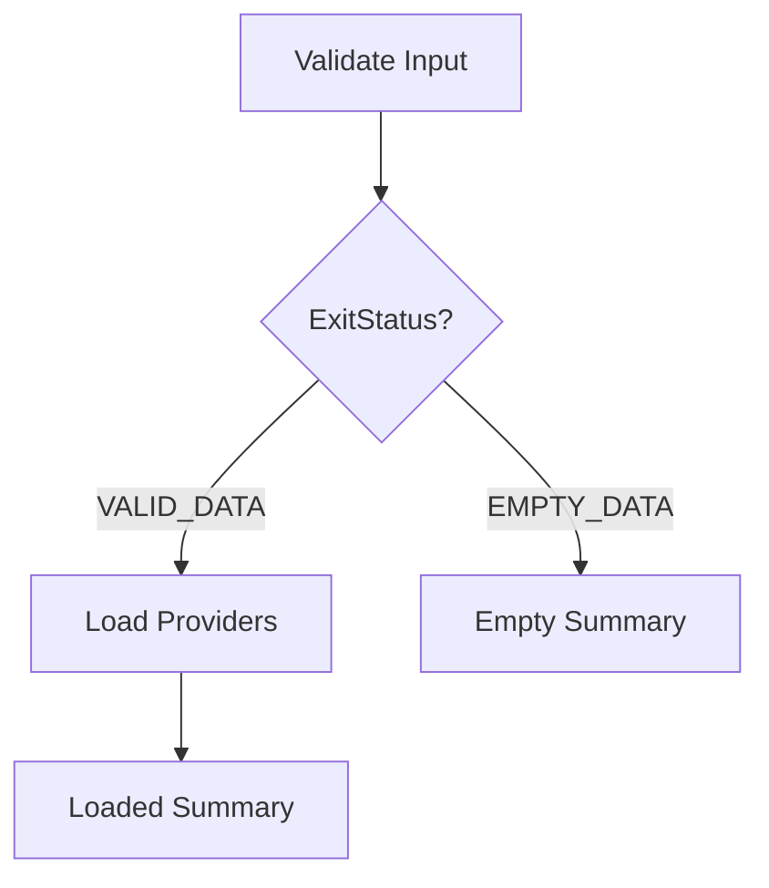

## Quick Start

This is a command-line Spring Batch app. The executable jar uses Spring Batch's `CommandLineJobOperator` as its entry point.

Build on Windows:

`.\mvnw.cmd clean package`

Build on Bash:

`./mvnw clean package`

When using Eclipse IDE, the built jar is created here:

`${project_loc:ncmmis-batch}/target/ncmmis-batch-1.0.jar`

To run a job:

`java -Dspring.profiles.active=<env> -jar target/ncmmis-batch-1.0.jar <job-config-class> start <job-name> [job-parameters]`

For example:

`java -Dspring.profiles.active=local -jar target/ncmmis-batch-1.0.jar org.ncmmis.batch.provider.job.hello.HelloWorldJob start helloWorldJob name=Jeff,java.lang.String`

Most provider jobs write to `ncmmis_provider`. When rerunning demos against a persistent database, reset the table or use demo jobs that intentionally clean up their own data.

## JUnit Tests

Each available job has a focused JUnit test that shows the expected Spring Batch status, step counts, and database effects. These tests are run against an in-memory H2 database, therefore no manual cleanup necessary.

These tests will automatically run with a Maven `clean package`.

You can also step through the tests individually, using (for example) Eclipse IDE.

## Available Jobs

### HelloWorldJob

Concept: a minimal tasklet step and simple job parameter access.

- Config class: `org.ncmmis.batch.provider.job.hello.HelloWorldJob`
- Job name: `helloWorldJob`
- Expected result: logs `Hello, <name>!`, defaulting to `World` when no name is supplied.

Start the job:

`java -Dspring.profiles.active=local -jar target/ncmmis-batch-1.0.jar org.ncmmis.batch.provider.job.hello.HelloWorldJob start helloWorldJob name=Jeff,java.lang.String`

### ProviderLoadJob

Concept: flat-file read, item processing, chunk commits, and JDBC batch writing.

- Config class: `org.ncmmis.batch.provider.job.load.ProviderLoadJob`
- Job name: `providerLoadJob`
- Input file: `data/input/provider/load/providers.csv`
- Expected result: loads `1000` provider rows into `ncmmis_provider`.

Start the job:

`java -Dspring.profiles.active=local -jar target/ncmmis-batch-1.0.jar org.ncmmis.batch.provider.job.load.ProviderLoadJob start providerLoadJob demoRun=load-demo-1,java.lang.String`

### ProviderFilterJob

Concept: filtering invalid-but-readable records by returning `null` from an item processor.

- Config class: `org.ncmmis.batch.provider.job.filter.ProviderFilterJob`
- Job name: `providerFilterJob`
- Input file: `data/input/provider/filter/providers.csv`
- Expected result: reads `10` records, filters `5`, and writes `5` provider rows to `ncmmis_provider`.

Start the job:

`java -Dspring.profiles.active=local -jar target/ncmmis-batch-1.0.jar org.ncmmis.batch.provider.job.filter.ProviderFilterJob start providerFilterJob demoRun=filter-demo-1,java.lang.String`

### ProviderSkipDemoJob

Concept: fault-tolerant processing skips for records that should be rejected by exception.

- Config class: `org.ncmmis.batch.provider.job.skip.ProviderSkipDemoJob`
- Job name: `providerSkipDemoJob`
- Input file: `data/input/provider/skip/providers.csv`
- Expected result: reads `5` records, skips provider ids `502` and `504`, and writes `3` provider rows to `ncmmis_provider`.

Start the job:

`java -Dspring.profiles.active=local -jar target/ncmmis-batch-1.0.jar org.ncmmis.batch.provider.job.skip.ProviderSkipDemoJob start providerSkipDemoJob demoRun=skip-demo-1,java.lang.String`

### ProviderRetryDemoJob

Concept: fault-tolerant retry for a transient processing failure.

- Config class: `org.ncmmis.batch.provider.job.retry.ProviderRetryDemoJob`
- Job name: `providerRetryDemoJob`
- Input file: `data/input/provider/retry/providers.csv`
- Expected result: provider id `602` fails twice, succeeds on the third processing attempt, and all `4` provider rows are written to `ncmmis_provider`.

Start the job:

`java -Dspring.profiles.active=local -jar target/ncmmis-batch-1.0.jar org.ncmmis.batch.provider.job.retry.ProviderRetryDemoJob start providerRetryDemoJob demoRun=retry-demo-1,java.lang.String`

### ProviderRestartDemoJob

Concept: restartability from the last committed chunk after a failed execution.

- Config class: `org.ncmmis.batch.provider.job.restart.ProviderRestartDemoJob`
- Job name: `providerRestartDemoJob`
- Input file: `data/input/provider/restart/providers.csv`
- Expected first run result: fails while processing provider id `350` after committing `300` provider rows.
- Expected restart result: resumes from the last committed chunk and completes the remaining rows, ending with `1000` provider rows in `ncmmis_provider`.

Start the job:

`java -Dspring.profiles.active=local -jar target/ncmmis-batch-1.0.jar org.ncmmis.batch.provider.job.restart.ProviderRestartDemoJob start providerRestartDemoJob demoRun=restart-demo-1,java.lang.String`

After the intentional failure, restart the failed execution by execution id:

`java -Dspring.profiles.active=local -jar target/ncmmis-batch-1.0.jar org.ncmmis.batch.provider.job.restart.ProviderRestartDemoJob restart <job-execution-id>`

Use a new `demoRun` value for each fresh demonstration, or reset the Spring Batch metadata before reusing the same value.

### ProviderMultiStepJob

Concept: sequential multi-step execution using a cleanup tasklet, chunk-oriented load step, and summary tasklet.

- Config class: `org.ncmmis.batch.provider.job.multistep.ProviderMultiStepJob`
- Job name: `providerMultiStepJob`
- Input file: `data/input/provider/multistep/providers.csv`
- Expected result: deletes existing `ncmmis_provider` rows, loads `4` provider rows, and logs the final provider count.

Start the job:

`java -Dspring.profiles.active=local -jar target/ncmmis-batch-1.0.jar org.ncmmis.batch.provider.job.multistep.ProviderMultiStepJob start providerMultiStepJob demoRun=multistep-demo-1,java.lang.String`

### ProviderConditionalFlowJob

Concept: conditional job routing based on a custom step exit status.

- Config class: `org.ncmmis.batch.provider.job.conditional.ProviderConditionalFlowJob`
- Job name: `providerConditionalFlowJob`
- Input file: `data/input/provider/conditional/providers.csv`
- Expected valid result: `inputMode=valid` routes through the load branch and writes `4` provider rows to `ncmmis_provider`.
- Expected empty result: `inputMode=empty` routes through the empty branch, skips loading, and completes with `0` provider rows written.

Start the valid branch:

`java -Dspring.profiles.active=local -jar target/ncmmis-batch-1.0.jar org.ncmmis.batch.provider.job.conditional.ProviderConditionalFlowJob start providerConditionalFlowJob inputMode=valid,java.lang.String demoRun=conditional-valid-demo-1,java.lang.String`

Start the empty branch:

`java -Dspring.profiles.active=local -jar target/ncmmis-batch-1.0.jar org.ncmmis.batch.provider.job.conditional.ProviderConditionalFlowJob start providerConditionalFlowJob inputMode=empty,java.lang.String demoRun=conditional-empty-demo-1,java.lang.String`
